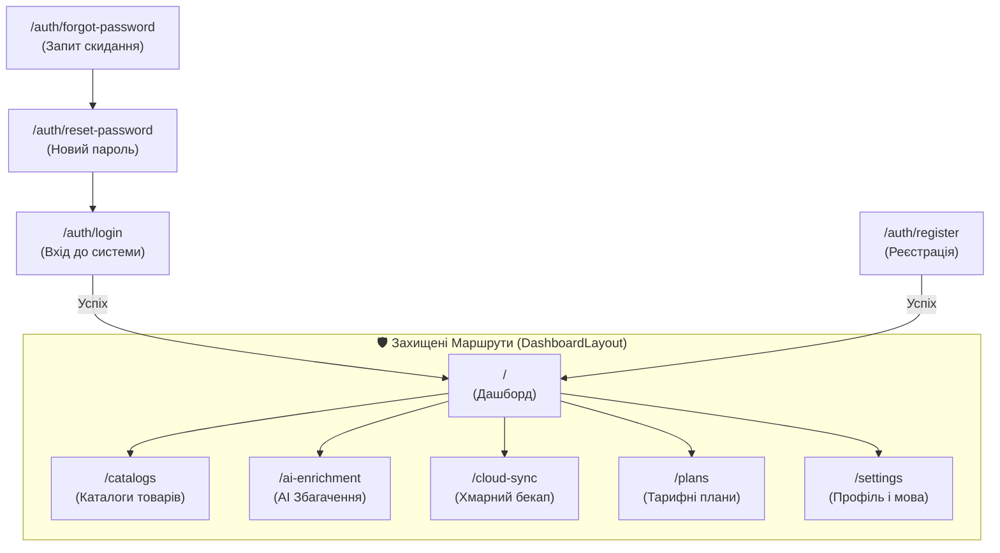

# 📱 Огляд Сторінок та Функціоналу Десктопного Клієнта

## 🗺 Карта Маршрутів Десктопного Додатку

---

## 📄 Детальний Огляд Екранів

### 1. Дашборд (`/`)

- Привітання авторизованого користувача з відображенням ролі та активного тарифу.
- Віджети швидкої статистики: підключені каталоги, статус останньої синхронізації, залишок AI-кредитів.
- Кнопка швидкого переходу до тарифів.

### 2. Каталоги Товарів (`/catalogs`)

- Перегляд списку завантажених фідів (Rozetka XML, Prom.ua YML, Google Merchant Center CSV).
- Фільтрація за форматом (XML / CSV / YML) та швидкий пошук товарів.
- **Політика доступу:** якщо термін тарифу завершився, сторінка замінюється компонентом `<ExpiredPlanBlocker />`, що запобігає маніпуляціям з товарами.

### 3. AI Збагачення (`/ai-enrichment`)

- Лічильник доступних AI-кредитів (`aiCredits`).
- Інструменти автоматичної генерації SEO-описів, структурованих характеристик та перекладів карток товарів.
- **Політика доступу:** блокується при `isExpired === true`.

### 4. Хмарна Синхронізація (`/cloud-sync`)

- Моніторинг локальних та хмарних знімків у MinIO / S3.
- Створення моментального знімку бази (`Create Snapshot Now`) за допомогою прямого завантаження через Presigned URL.
- **Політика доступу:** блокується при `isExpired === true`.

### 5. Тарифи та Підписка (`/plans`)

- Картки тарифних планів: `STARTER` (Старт), `GROWTH` (Зріст), `PRO` (Про), `ENTERPRISE` (Корпоратив).
- Відображення плашки активного плану: "Ваш поточний план", бейджа популярності "Популярний" та бейджа закінчення "Термін закінчився".
- Лічильник зворотного відліку: "Залишилось N дн." / "N days remaining".
- Інтерактивна кнопка **"Обрати тариф"** / **"Продовжити тариф"** з миттєвим оновленням стану та розблокуванням додатку.
- Завжди залишається доступною для користувача навіть у заблокованому стані!

### 6. Налаштування (`/settings`)

- Зміна мови інтерфейсу (Українська / English).
- Вибір колірної теми (Zinc, Slate, Stone, Bronze) та перемикач темного/світлого режиму.
- Зміна паролю користувача.
