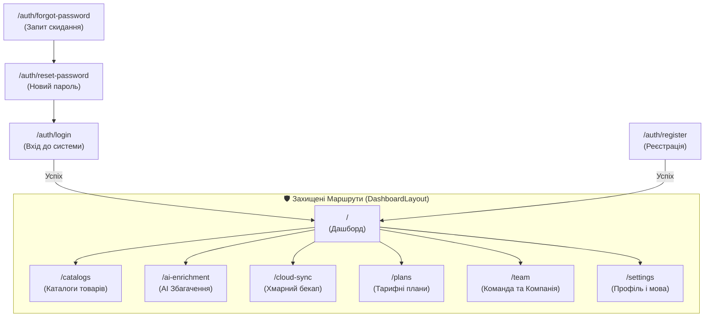

# 📱 Огляд Сторінок та Функціоналу Десктопного Клієнта

## 🗺 Карта Маршрутів Десктопного Додатку

---

## 📄 Детальний Огляд Екранів

### 1. Дашборд (`/`)

- Привітання авторизованого користувача з відображенням ролі та активного тарифу.
- Віджети швидкої статистики: підключені каталоги, статус останньої синхронізації, залишок AI-кредитів.
- Кнопка швидкого переходу до тарифів.

### 2. Каталоги Товарів (`/catalogs`)

- Перегляд списку завантажених фідів (Rozetka XML, Prom.ua YML, Google Merchant Center CSV).
- Фільтрація за форматом (XML / CSV / YML) та швидкий пошук товарів.
- **Політика доступу:** якщо термін тарифу завершився, сторінка замінюється компонентом `<ExpiredPlanBlocker />`, що запобігає маніпуляціям з товарами.

### 3. AI Збагачення (`/ai-enrichment`)

- Лічильник доступних AI-кредитів (`aiCredits`).
- Інструменти автоматичної генерації SEO-описів, структурованих характеристик та перекладів карток товарів.
- **Політика доступу:** блокується при `isExpired === true`.

### 4. Хмарна Синхронізація (`/cloud-sync`)

- Моніторинг локальних та хмарних знімків у MinIO / S3.
- Створення моментального знімку бази (`Create Snapshot Now`) за допомогою прямого завантаження через Presigned URL.
- **Політика доступу:** блокується при `isExpired === true`.

### 5. Тарифні Плани та Порівняльна Матриця (`/plans`)

- **Сегментований перемикач режимів (Segmented View Switcher)**:
  - 🗂️ **Картки тарифів (`LayoutGrid`)**: 4-колонковий адаптивний перегляд тарифів (`STARTER`, `GROWTH`, `PRO`, `ENTERPRISE`), 4 квоти (Товари, Постачальники, Канали, AI), чітке розділення на доступні можливості (✅) та недоступні в поточному тарифі (❌ сірі закреслені), ціни в грн та знижка -20% за рік.
  - 📊 **Порівняльна матриця (`TableProperties`)**: інтерактивна таблиця 1-в-1 з адмінкою за 4 категоріями:
    1. 📥 **Вхідні ліміти (Input Quotas)** (`ArrowDownToLine`)
    2. 📤 **Вихідні канали експорту (Output Channels)** (`Share2`)
    3. ⚙️ **Ресурси та автоматизація (Resources & Automation)** (`Cpu`)
    4. 🛡️ **B2B & Розширений функціонал (Enterprise & Advanced)** (`ShieldCheck`)
- **Інтерактивні дії клієнта та Оформлення підписки (`PaymentCheckoutModal`)**:
  - Бейдж та disabled статус «Ваш поточний тариф» для активного плану.
  - Для безкоштовного `STARTER`: миттєвий перехід без виклику платіжного шлюзу.
  - Для платних тарифів (`GROWTH`, `PRO`, `ENTERPRISE`): відкриття модального вікна `PaymentCheckoutModal`:
    - **Review:** підсумок замовлення, період (щомісяця або щорічно зі знижкою 20%), сума у грн, ліміти SKU/AI/каналів, 256-bit SSL захист WayForPay.
    - **Оплата:** перехід до платіжної сторінки WayForPay (`POST /api/payments/checkout`).
    - **Sandbox термінал:** швидкі кнопки тестування для симуляції `Approved` (успіх) та `Declined` (відхилення банком).
    - **Розблокування доступу (`Approved`):** миттєве подовження ліцензії (30 або 365 днів), оновлення `LicenseContext` та `NavigationContext`, повне зняття блокувальника `ExpiredPlanBlocker` та доступ до Каталогів, AI та Хмари.
    - **Захист блокування (`Declined`):** сповіщення про причину відхилення банком, доступ до каталогів залишається заблокованим до успішної оплати.
- **Динамічна синхронізація з адмінкою**: миттєве відображення оновлених цін, квот та списку переваг з бекенду (`GET /api/plans`) без дублювання запитів (`Zero-Duplicate Requests`).
- Завжди залишається доступною для користувача навіть у заблокованому стані!

### 6. Команда та Компанія (`/team`)

- **Дані компанії:** назва організації, власник, бейдж тарифного плану та лічильник днів до завершення дії.
- **Редагування назви:** власник може оновити назву організації через модальне вікно `EditCompanyNameDialog`.
- **Командні місця (`maxTeamSeats`):**
  - `STARTER` / `GROWTH`: 1/1 місць (Solo-режим) з інформаційним блоком про переваги командної роботи.
  - `PRO`: до 3 місць (Власник + 2 колеги) з візуальним прогрес-баром використання.
  - `ENTERPRISE`: безліміт місць (`used / ∞`).
- **Інтелектуальна кнопка «Запросити колегу» (Always Clickable):**
  - При наявності вільних місць: відкриває форму інвайту `InviteMemberDialog` (вибір ролі: `MEMBER` або `ADMIN`).
  - При вичерпаному ліміті або соло-тарифі: відкриває модальне вікно пропозиції апгрейду `UpgradeTeamSeatsDialog` з прямим переходом до `/plans`.
- **Список учасників:** картки співробітників, ролі, дата входу та кнопка вилучення (`RemoveMemberDialog`), що вивільняє місце в тарифі.

### 7. Налаштування (`/settings`)

- Зміна мови інтерфейсу (Українська / English).
- Вибір колірної теми (Zinc, Slate, Stone, Bronze) та перемикач темного/світлого режиму.
- Зміна паролю користувача.
