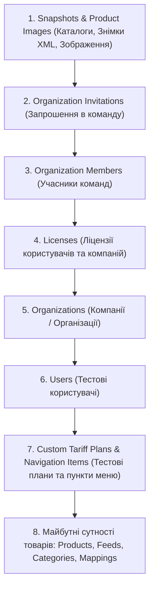

# 🧹 Політика Ізоляції та Повного Очищення Тестових Даних (Zero Leftovers Policy)

## 📌 1. Чому "Нульові Залишки" (Zero Leftovers) критично важливі?

У великих enterprise-платформах з багаторівневими інтеграційними та E2E тестами будь-які залишкові тестові дані в базі PostgreSQL, сховищі MinIO/S3 чи браузері викликають серйозні проблеми:

- **Колізії унікальних полів**: Падіння тестів при повторному запуску через порушення `unique constraint` (`email`, `licenseKey`, `token`, `slug`, `sku`).
- **Засмічення робочого середовища**: Змішування реальних облікових записів розробника з сотнями фейкових записів.
- **Flaky Tests**: Витік стану (state leakage), коли тест №2 бачить дані, залишені тестом №1, що робить результат тестів залежним від порядку їх виконання.

---

## 🏛 2. Повна Ієрархія та Порядок Видалення Даних (FK-Safe Sequence)

Через наявність реляційних зв'язків та зовнішніх ключів (`Foreign Keys`), видалення сутностей у базі даних виконується у строгому порядку від **найбільш залежних (дочірніх)** до **базових (батьківських)**:



---

## 📋 3. Повний Реєстр Сутностей, що Створюються та Видаляються в Тестах

| №   | Сутність (Prisma Model)                                | Що створюється під час тестів                                            | Як і коли гарантовано видаляється                                             |
| --- | ------------------------------------------------------ | ------------------------------------------------------------------------ | ----------------------------------------------------------------------------- |
| 1   | **`Snapshot`**                                         | Тимчасові бекапи знімків XML-фідів та метаданих                          | Видаляються за `userId` усіх тестових акаунтів перед видаленням користувачів. |
| 2   | **`ProductImage`**                                     | Записи оптимізованих/завантажених фотографій товарів                     | Видаляються за `userId` тестових акаунтів.                                    |
| 3   | **`OrganizationInvitation`**                           | Запрошення з токенами `SF-INV-*` та email інвайтів                       | Видаляються за `invitedById`, `organizationId` або за префіксами email.       |
| 4   | **`OrganizationMember`**                               | Зв'язки співробітників з компаніями                                      | Видаляються за `userId` та `organizationId`.                                  |
| 5   | **`License`**                                          | Згенеровані ліцензії `SF-*-*` (Starter, Pro, Enterprise)                 | Видаляються за `userId`, `organizationId` або ключами `SF-TEST-*`.            |
| 6   | **`Organization`**                                     | Тестові компанії (`orgtest-*`, `Acme*`, `Rozetka*`, `Globex*`)           | Видаляються за `ownerId` або назвами компаній.                                |
| 7   | **`User`**                                             | Тестові облікові записи (`e2e.test+*`, `admintest-*`, `inv.test+*` тощо) | Видаляються за точними ID та префіксами email.                                |
| 8   | **`TariffPlan`**                                       | Спеціальні плани тестування (`CUSTOM_ULTRA`, `TEST_*`, `PLAN_*`)         | Видаляються за кодами планів; базові плани (`STARTER` тощо) відновлюються.    |
| 9   | **`NavigationItem`**                                   | Динамічні пункти меню (`analytics_*`, `custom_*`, `test_*`)              | Видаляються за унікальними ключами.                                           |
| 10  | **Майбутні товари (`Product`, `Feed`, `CatalogItem`)** | Товари з каталогів XML/CSV, фіди, категорії, мапінги                     | Будуть видалятися в кроці №1 (перед ліцензіями та організаціями).             |

---

## 🛠 4. Стандартизований Хелпер `cleanDatabase()`

Для забезпечення 100% одноманітності у монорепозиторії створено централізований хелпер:
`services/backend-api/test/utils/teardown.helper.ts`

### Приклад використання в E2E тестах:

```typescript
import { cleanDatabase } from './utils/teardown.helper';

describe('My Feature (E2E)', () => {
  let prisma: PrismaService;
  const createdEmails: string[] = [];

  beforeAll(async () => {
    // 1. Очищення перед початком тесту (на випадок перерваного попереднього запуску)
    await cleanDatabase(prisma, {
      userEmails: createdEmails,
      emailPrefixes: ['myfeature.test+'],
    });
  });

  afterAll(async () => {
    // 2. Фінальне очищення після завершення всіх тест-кейсів
    await cleanDatabase(prisma, {
      userEmails: createdEmails,
      emailPrefixes: ['myfeature.test+'],
    });

    await app.close();
  });
});
```

---

## 🌐 5. Правила для Фронтенд-Тестів (Playwright)

У кожному файлі `*.spec.ts` десктопного додатку та адмін-панелі:

- **`beforeEach`**: Очищає `localStorage`, `sessionStorage`, cookies та скидає всі активні route-моки.
- **`afterEach` / `afterAll`**: Закриває всі відкриті діалогові вікна, скасовує фонові запити.

```typescript
test.beforeEach(async ({ page }) => {
  await page.addInitScript(() => {
    window.localStorage.clear();
    window.sessionStorage.clear();
  });
});
```
