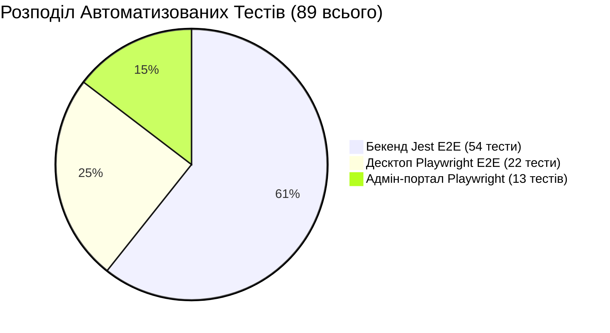

# 🔬 Стратегія Тестування — SmartFeed Studio

## 📌 Рівні Тестування та Інструменти

У проекті запроваджено комплексну багаторівневу піраміду тестування:

---

## 🎯 Методології та Правила

1. **Test-Driven Development (TDD)**:
   - Новий функціонал (наприклад, динамічні терміни дії, відновлення паролю, вибір тарифів) спочатку покривається тестами, які фіксують очікувану поведінку (RED), після чого реалізується мінімально необхідний код (GREEN) та проводиться рефакторинг.

2. **Page Object Model (POM) для Playwright**:
   - Усі тести адмін-панелі та десктопу використовують селектори на основі `data-testid` та виділені класи сторінок, що гарантує стабільність тестів при зміні стилів чи CSS-класів.

3. **Тестування Мультимовності (i18n Testing)**:
   - Кожен новий екран або форма **обов'язково** тестується на коректність перекладу при зміні мови (`UA` ⇄ `EN`).
   - Перевіряється перехоплення серверних помилок функцією `getErrorMessage`, щоб запобігти витоку сирих англійських рядків у локалізований інтерфейс.
