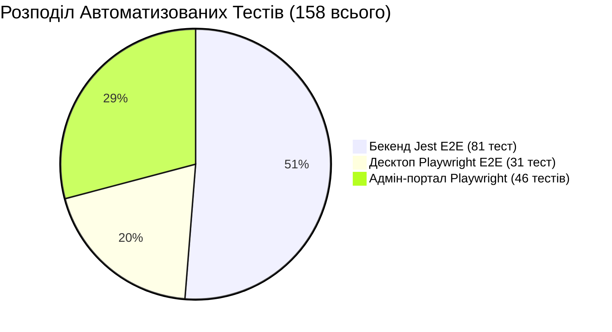

# 🔬 Стратегія Тестування, Рев'ю Коду та Запобігання Помилкам — SmartFeed Studio

## 📌 1. Рівні Тестування та Покриття (158 Тестів — 100% PASS)

У проекті запроваджено комплексну багаторівневу піраміду тестування:

---

## 🧠 2. Матриця Скілів для Запобігання Помилкам у Коді

### ⚙️ Бекенд (NestJS 11 + CQRS + Prisma + PostgreSQL + Redis):

1. **`nestjs-best-practices` & `backend-development`**:
   - Суворе CQRS розділення команд (`CommandBus`) та запитів (`QueryBus`).
   - Централізована обробка винятків (`GlobalHttpExceptionFilter`), DTO валідація (`ValidationPipe` з `whitelist: true`).
2. **`defense-in-depth-validation`**:
   - 4-рівневий захист: DTO → Бізнес-логіка/квоти → Auth/License Guards → DB Constraints.
3. **`sentry-backend-bugs`**:
   - Запобігання неперехопленим промісам, перевірка `null/undefined` для необов'язкових реляцій, захист від витоку пам'яті у чергах BullMQ.
4. **`supabase-postgres-best-practices` & `prisma-postgres`**:
   - 100% індексація зовнішніх ключів (`@@index([fkColumn])`).
   - Відмова від `OFFSET` пагінації на користь cursor-based для великих фідів.
   - Пул підключень через `@prisma/adapter-pg`.
5. **`subscription-lifecycle`**:
   - Динамічний розрахунок термінів дій ліцензій (`durationDays`), grace-періоди, блокування неактивних ліцензій через `RequireActiveLicenseGuard`.

---

### 💻 Фронтенд (React 18 + Next.js 14 + Tauri v2 + Tailwind CSS):

1. **`vercel-react-best-practices`**:
   - Мінімізація ререндерів, дедуплікація in-flight запитів через `useRef`, відсутність `React.StrictMode` подвійного монтування у dev.
2. **`frontend-design`, `beautiful-desing` & `shadcn`**:
   - Єдина система HSL токенів, типографіка Inter, темна/світла теми, компактні модульні компоненти (макс. 250–300 рядків).
3. **`integrate-backend`**:
   - Безпечний мапінг DTO зі `@smartfeed/shared`, перехоплення та двомовна локалізація серверних помилок.

---

### 🧪 Тестування та QA:

1. **`playwright-best-practices`**:
   - Page Object Model (POM), ізоляція тестів (`localStorage.clear()`), детерміновані очікування подій.
2. **`test-driven-development-tdd`**:
   - RED → GREEN → REFACTOR цикл для всіх нових фіч та фіксів.
3. **`testing-anti-patterns`**:
   - 3 залізні правила: 1. Не тестувати мок-поведінку; 2. Не додавати тестові методи у продакшн-код; 3. Не мокати без розуміння залежностей.
4. **`condition-based-waiting`**:
   - Опитування умов замість довільних затримок `sleep`.
5. **`verification-before-completion`**:
   - Повна статична типізація `tsc --noEmit` + `pnpm build:shared` + прогін тестів перед завершенням завдання.

---

## 🧹 3. Політика Очищення Даних (Zero Leftovers)

Кожен тест E2E використовує універсальний хелпер `cleanDatabase()`:

- `Snapshots` & `ProductImages` → `OrganizationInvitations` → `OrganizationMembers` → `Licenses` → `Organizations` → `Users` → `TariffPlans` & `NavigationItems`.
- Гарантує нульові залишки та абсолютну чистоту бази даних.
